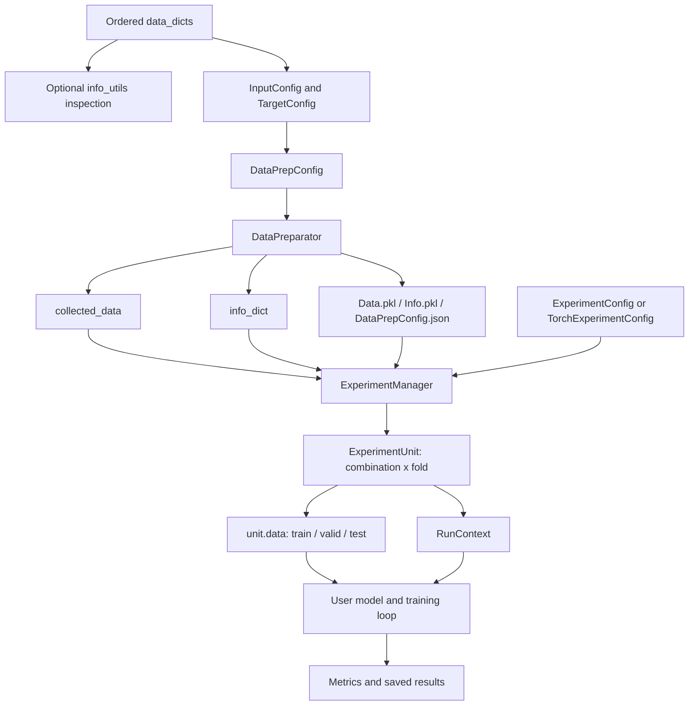

# FlexMM Workflow Guide

This document describes the complete FlexMM lifecycle, from ordered sample dictionaries to fold-specific experiment units and saved results.

FlexMM separates the workflow into three layers:

1. **information organization** with `info_utils`;
2. **data preparation** with `data_prep`;
3. **experiment orchestration** with `experiment`.

The framework is model-agnostic. It prepares data and experiment conditions but leaves model construction and training to the user.

---

## 1. Architecture overview



The central invariant is:

> Every prepared sample, target, split assignment, sequence anchor, and experiment condition must remain traceable to the original ordered `data_dicts` index.

---

## 2. Input contract

### 2.1 One dictionary per ordered sample

`data_dicts` is a list where each element represents one sample, frame, utterance, segment, trial, or event.

```python
sample_infos = [
    {
        "sample_id": "utt_0001",
        "speaker": "P01",
        "session": "S01",
        "audio": audio_feature_1,
        "text": text_feature_1,
        "label": "neutral",
    },
    {
        "sample_id": "utt_0002",
        "speaker": "P02",
        "session": "S01",
        "audio": audio_feature_2,
        "text": text_feature_2,
        "label": "positive",
    },
]
```

The list order is semantically important because it defines:

- original sample indexes;
- temporal adjacency;
- turn boundaries;
- sequence windows;
- deterministic split order.

### 2.2 Recommended field categories

| Category | Examples | Role |
|---|---|---|
| Stable identifier | `sample_id` | Auditing and external references. |
| Split/group reference | `speaker`, `participant`, `group`, `session` | Group-aware splitting and sequence grouping. |
| Input modality | `audio`, `video`, `text`, `sensor` | Model input. |
| Target | `label`, `score`, `valence` | Supervision. |
| Descriptive information | timestamp, condition, source path | Optional metadata and analysis. |

The framework aligns by original list index, not by `sample_id`. A stable `sample_id` remains highly recommended so users can inspect or export split assignments safely.

### 2.3 Supported value forms

Preparation can gather:

- Python numeric scalars;
- NumPy arrays;
- PyTorch tensors when PyTorch is installed;
- numeric lists;
- nested or nonnumeric lists;
- strings and other scalar objects.

Compatible numeric values are converted to NumPy arrays. Heterogeneous values remain lists.

All configured keys must be present in every processed dictionary. Numeric values intended for a dense array should have compatible shapes.

---

## 3. Inspecting sample information

`flexmm.info_utils` works directly on `data_dicts` and is useful before creating a preparation configuration.

### 3.1 Group-to-index mapping

```python
from flexmm import info_utils

speaker_to_indexes = info_utils.get_ref_value2indexes(
    sample_infos,
    ref_key="speaker",
)
```

Example result:

```python
{
    "P01": [0, 1, 4],
    "P02": [2, 3],
}
```

### 3.2 Group-to-target relationship

```python
speaker_to_labels = info_utils.get_ref_value2another(
    sample_infos,
    ref_key="speaker",
    another_key="label",
    unique_values=True,
)
```

Use `unique_values=False` when repeated values and frequency matter.

### 3.3 Turn construction

```python
turn_info = info_utils.get_turn2ref_value_and_indexes(
    sample_infos,
    ref_key="speaker",
)
```

A new turn starts when:

- the reference value changes; or
- processed indexes are no longer consecutive.

This distinction matters because sequence grouping by a reference key uses consecutive runs rather than combining every occurrence of the same speaker into one long sequence.

### 3.4 Adjacency and intervals

The module also provides:

- `get_ref_value2turn_indexes()`;
- `get_ref_value2turns()`;
- `get_ref_value2indexes_in_turns()`;
- `get_ref_value2adjacent_ref_value()`;
- `get_interval_split_indexes()`.

These utilities are analysis helpers. They do not alter `data_dicts`.

---

## 4. Configuring data keys

Every model input or target is described by a key-level configuration.

### 4.1 Shared `BaseConfig` fields

The following settings are inherited by input and target configurations:

| Field | Meaning |
|---|---|
| `keys` | One key or a list of keys sharing the same settings. |
| `seq_len_before` | Context positions before the anchor. |
| `seq_len_after` | Context positions after the anchor. |
| `step_offset` | Relative alignment offset for this key. |
| `stride` | Distance between context positions. |
| `seq_pos_from_start` | Candidate anchors removed from each range start. |
| `seq_pos_from_end` | Candidate anchors removed from each range end. |
| `seq_padding` | Whether incomplete windows are padded. |
| `seq_padding_mode` | `"constant"` or `"edge"`. |
| `seq_padding_value` | Constant padding value. |
| `keep_batch_seq_dims` | Preserve batch/sequence-oriented dimensions when possible. |
| `squeeze_singleton_dims` | Remove singleton dimensions during gathering. |
| `standardize_data` | Enable runtime standardization for inputs. |
| `standardize_scope` | Fit statistics on `"split"` training data or `"all"` prepared data. |
| `dtype` | Requested NumPy dtype. |

### 4.2 Inputs

```python
from flexmm.data_prep import InputConfig

input_config = InputConfig(
    keys=["audio", "text"],
    seq_len_before=2,
    seq_len_after=2,
    seq_padding=True,
    standardize_data=True,
    standardize_scope="split",
    dtype="float32",
)
```

Input settings apply independently to every key listed in the config.

### 4.3 Classification targets

```python
from flexmm.data_prep import ClassificationTargetConfig

label_config = ClassificationTargetConfig(
    keys="label",
    convert_target_to_id=True,
)
```

Classification targets must be scalar or scalar-like. When conversion is enabled, prepared target values become integer class IDs; the original-to-ID mapping is saved in `info_dict`.

### 4.4 Regression targets

```python
from flexmm.data_prep import RegressionTargetConfig

score_config = RegressionTargetConfig(
    keys="score",
    stratified_bin_num=10,
    convert_target_to_bin=False,
)
```

Regression bins are primarily used to approximate target balance during stratified splitting. Setting `convert_target_to_bin=True` also replaces prepared scalar values with bin representatives.

For vector or matrix targets:

```python
trajectory_config = RegressionTargetConfig(
    keys="trajectory",
    is_multi_dim=True,
)
```

Multidimensional targets are not eligible for stratified splitting.

---

## 5. Configuring the preparation pipeline

```python
from flexmm.data_prep import DataPrepConfig

prep_config = DataPrepConfig(
    focused_target_key="label",
    split_ref_key="speaker",
    split_dependency="independent",
    independent_split_valid_by="ref_key",
    split_mode="kfold",
    folds=5,
    train_valid_ratio=0.8,
    holdout_test_ratio=0.2,
    use_stratified_split=False,
    seq_group_mode="ref_key",
    seq_group_key="speaker",
    remove_test_train_overlap_range=True,
    remove_train_valid_overlap_range=False,
    remove_overlap_priority=["test", "train", "valid"],
    data_configs=[input_config, label_config],
    save_prepared_data=True,
    overwrite_data=True,
    store_dir="./ExperimentStore/demo",
)
```

### 5.1 Focused target

`focused_target_key` identifies the target used for:

- stratified splitting;
- determining effective sequence anchors;
- sequence-index metadata alignment.

When omitted, the first configured target is selected.

### 5.2 Split reference key

`split_ref_key` defines the grouping variable used by independent or dependent splits. Typical choices are:

- speaker;
- participant;
- family/group;
- conversation session;
- recording ID.

### 5.3 Sequence grouping

#### Reference-key mode

```python
seq_group_mode="ref_key"
seq_group_key="speaker"
```

The preparator identifies consecutive turns/runs of the same reference value and prevents windows from crossing those boundaries.

If `seq_group_key=None`, `split_ref_key` is used.

#### Index mode

```python
seq_group_mode="index"
```

The full ordered dataset is treated as one sequence range.

#### Custom ranges

```python
seq_ranges_custom=[(0, 100), (150, 220)]
```

Ranges are half-open: `(start, end)` includes `start` and excludes `end`.

`include_seq_inter_ranges=True` fills uncovered intervals so the complete dataset is partitioned into ranges around the custom boundaries.

---

## 6. The `DataPreparator` lifecycle

```python
from flexmm.data_prep import DataPreparator

preparator = DataPreparator(sample_infos, prep_config)
collected_data, info_dict = preparator.run()
```

`run()` performs the following stages in order.

### Stage 0: initialize sequence ranges and index mappings

The preparator determines sequence boundaries and creates an initial list of indexes covered by those ranges.

It maintains two mapping directions:

```python
id2ori_index
ori_index2id
```

These mappings become especially important after sequence filtering removes some original samples.

### Stage 1: construct per-key sequence indexes

For every configured input and target key, the preparator constructs windows according to:

- before/after length;
- stride;
- filtering from sequence starts/ends;
- padding;
- key-specific offset.

All keys must produce the same number of prepared samples. If they do not, preparation fails early instead of silently misaligning modalities and targets.

### Stage 2: gather aligned data

Each configured key is collected into `collected_data`.

Two internal keys are added:

```python
from flexmm.data_prep import ORI_INDEX_KEY, SEQ_INDEX_KEY
```

- `ORI_INDEX_KEY` stores the original anchor index for every prepared sample.
- `SEQ_INDEX_KEY` stores the sequence-index list associated with the focused target.

### Stage 3: process targets

For classification, the preparator creates:

```python
target2id
id2target
target_stats
target2indexes
```

For scalar regression, it creates:

```python
target_stats
target_bin_ranges
target2indexes
```

For multidimensional regression, it records target shape information.

Requested class-ID or regression-bin conversion is applied to `collected_data`, not to the original `data_dicts`.

### Stage 4: create train/validation/test splits

The preparator invokes one of three split strategies described in the next section.

Split assignments refer to **original sample indexes**.

### Stage 5: remove prohibited sequence overlap

Sequence windows can overlap even when their anchors belong to different splits. For example:

```text
train anchor 10 -> sequence [8, 9, 10, 11]
test anchor 12  -> sequence [10, 11, 12, 13]
```

If test/train overlap removal is enabled, lower-priority anchors are removed according to `remove_overlap_priority`.

### Stage 6: assemble `info_dict`

`info_dict` contains:

```python
info_dict["index_split_folds"]
info_dict["ref_value_split_folds"]
info_dict["id2ori_index"]
info_dict["ori_index2id"]
info_dict["target_info"]
info_dict["input_shapes"]
```

### Stage 7: save prepared artifacts

When enabled, preparation saves:

```text
Data.pkl
Info.pkl
DataPrepConfig.json
```

The saved configuration can be reconstructed with `load_config()`, and all three artifacts can be loaded with `load_data()`.

---

## 7. Split semantics in detail

FlexMM separates two decisions:

1. **dependency semantics**: how the reference groups relate across splits;
2. **test mode**: holdout, k-fold, or leave-one-out.

### 7.1 Independent splitting

```python
split_dependency="independent"
```

Test reference values never appear in train or validation.

This is the default choice for generalization to unseen speakers, participants, groups, or sessions.

#### Independent validation by reference key

```python
independent_split_valid_by="ref_key"
```

Train, validation, and test use separate reference values.

#### Independent validation by index

```python
independent_split_valid_by="index"
```

Test groups remain unseen, but train and validation can contain samples from the same non-test groups.

#### Explicit reference overrides

You can provide fold-specific or shared reference values:

```python
train_ref_values_override={0: ["P01", "P02"]}
valid_ref_values_override={0: ["P03"]}
test_ref_values_override={0: ["P04"]}
```

Overrides are validated for unknown values, overlap, and coverage.

### 7.2 Dependent splitting

```python
split_dependency="dependent"
independent_split_valid_by=None
```

Every reference group is split internally, so the same reference value may appear in train, validation, and test.

This is appropriate only when evaluation is intended to measure within-subject or within-group generalization.

For dependent leave-one-out, groups must contain the same number of eligible samples so the corresponding position can be held out in each fold.

### 7.3 Unconstrained splitting

```python
split_dependency="none"
independent_split_valid_by=None
```

The split ignores reference groups and operates over eligible sample indexes.

### 7.4 Holdout

```python
split_mode="holdout"
holdout_test_ratio=0.2
```

One test split is created. Nonempty datasets receive at least one test item while retaining non-test data when possible.

### 7.5 K-fold

```python
split_mode="kfold"
folds=5
```

Eligible reference values or samples are distributed across the requested folds. When the number of independent reference values is lower than `folds`, the effective fold count is reduced.

### 7.6 Leave-one-out

```python
split_mode="leave_one_out"
```

The held-out unit depends on the split semantics:

- independent: one reference value per fold;
- dependent: one corresponding sample position from every reference group per fold;
- unconstrained: one sample per fold.

### 7.7 Stratification

```python
use_stratified_split=True
focused_target_key="label"
```

Stratification is supported for:

- scalar classification targets;
- scalar regression targets after binning.

It is not supported for multidimensional targets.

Stratification is deterministic and based on existing order within each target group. It is not a randomized stratified splitter.

---

## 8. Understanding the three index spaces

This is the most important implementation detail for downstream users.

### 8.1 Original index

The position in the input `data_dicts` list:

```python
sample_infos[37]
```

Split functions operate in this index space.

### 8.2 Sequence anchor

The original index representing one prepared sequence sample. A sequence around anchor `37` might contain:

```python
[35, 36, 37, 38, 39]
```

Filtering, offsets, and custom ranges can remove or shift anchors.

### 8.3 Prepared ID/position

The dense zero-based position inside `collected_data`:

```python
collected_data["audio"][prepared_id]
```

If only original indexes `[10, 20, 40]` survive preparation, then:

```python
ori_index2id == {10: 0, 20: 1, 40: 2}
id2ori_index == {0: 10, 1: 20, 2: 40}
```

`ExperimentManager` translates original split indexes to prepared positions before indexing `collected_data`.

Both forms are retained in `RunContext`:

```python
context.split_indexes
context.prepared_split_indexes
```

Never use original split indexes directly to index a compacted `collected_data` array unless the mapping is known to be identity.

---

## 9. Loading or reusing prepared data

### 9.1 Two-stage workflow

Prepare once:

```python
DataPreparator(sample_infos, prep_config).run()
```

Then run many experiments:

```python
exp_config = ExperimentConfig(
    experiment_input_keys=["audio", "text"],
    experiment_target_keys="label",
    load_prepared_data=True,
    store_dir="./ExperimentStore/demo",
)

manager = ExperimentManager(exp_config).setup()
```

This is recommended when comparing many model architectures or hyperparameter settings over the same prepared folds.

### 9.2 Single-script workflow

```python
exp_config = ExperimentConfig(
    experiment_input_keys=["audio", "text"],
    experiment_target_keys="label",
    load_prepared_data=False,
    store_dir="./ExperimentStore/demo",
)

manager = ExperimentManager(
    exp_config=exp_config,
    data_dicts=sample_infos,
    data_prep_config=prep_config,
).setup()
```

The manager invokes `DataPreparator` internally.

---

## 10. Experiment configuration

### 10.1 Input combinations

```python
from flexmm.experiment import ExperimentConfig

exp_config = ExperimentConfig(
    experiment_input_keys=["audio", "text", "video"],
    experiment_target_keys="label",
    generate_input_comb=True,
)
```

This produces every nonempty combination:

```text
[audio]
[text]
[video]
[audio, text]
[audio, video]
[text, video]
[audio, text, video]
```

Use one complete combination only:

```python
generate_input_comb=False
```

Or provide explicit combinations:

```python
input_comb_custom=[
    ["audio"],
    ["text"],
    ["audio", "text"],
]
```

Custom combinations override `experiment_input_keys` and `generate_input_comb`.

### 10.2 Combination names

```python
input_key_abbr={
    "audio": "A",
    "text": "T",
    "video": "V",
}
```

The combination `['audio', 'text']` receives a directory name such as:

```text
Comb_A-T
```

### 10.3 Reproducibility

```python
random_seed=42
random_seed_scope=["random", "numpy", "torch"]
```

The manager seeds only the listed systems. The seed is copied into every `RunContext`.

Model-specific nondeterminism, data-loader workers, and CUDA backend behavior remain the training script's responsibility.

---

## 11. `ExperimentManager`, `ExperimentUnit`, and `RunContext`

### 11.1 Manager lifecycle

```python
manager = ExperimentManager(exp_config).setup()
```

`setup()`:

1. loads or prepares shared data;
2. validates requested input and target keys;
3. initializes random seeds;
4. saves `ExpConfig.json`;
5. marks the manager ready for iteration.

The manager is re-iterable:

```python
for unit in manager:
    ...

for unit in manager:
    ...  # complete iteration again
```

Each iteration creates fresh per-condition data rather than returning an already-consumed generator.

### 11.2 Unit generation

The manager yields one `ExperimentUnit` for every:

```text
input combination × fold
```

```python
for unit in manager:
    train_data = unit.data["train"]
    valid_data = unit.data["valid"]
    test_data = unit.data["test"]
```

### 11.3 Run context

```python
context = unit.context
```

| Field | Meaning |
|---|---|
| `fold` | Prepared fold identifier. |
| `comb_index` | Position of the input combination. |
| `comb_name` | File-system-safe combination name. |
| `input_comb` | Active input keys. |
| `target_keys` | Active target keys. |
| `split_indexes` | Original indexes for train/valid/test. |
| `prepared_split_indexes` | Prepared positions for train/valid/test. |
| `ref_value_splits` | Speaker/group/session values assigned to each split. |
| `standardization_info` | Per-key mean, standard deviation, scope, and source. |
| `info_dict` | Shared preparation information. |
| `exp_config` | Experiment configuration. |
| `data_prep_config` | Preparation configuration. |
| `output_dir` | Recommended per-condition result directory. |
| `seed` | Base experiment seed. |
| `user_extras` | User-defined information copied into every run. |

Use `user_extras` for stable information needed by training but not owned by FlexMM:

```python
manager = ExperimentManager(
    exp_config,
    user_extras={
        "model_family": "late_fusion",
        "project_name": "emotion_recognition",
    },
)
```

---

## 12. Standardization behavior

Standardization happens while each `ExperimentUnit` is created. Shared `collected_data` is not mutated.

### 12.1 Fold-level standardization

```python
standardize_data=True
standardize_scope="split"
```

For each input key and fold:

1. collect the current training split;
2. calculate feature-wise mean and standard deviation from training data;
3. apply the same statistics to train, validation, and test;
4. map zero-variance dimensions to zero safely;
5. store statistics in `context.standardization_info`.

This prevents validation/test leakage.

### 12.2 Global standardization

```python
standardize_scope="all"
```

Statistics are calculated from all prepared samples. This may be appropriate for a deliberate deployment preprocessing convention, but it leaks information in ordinary evaluation and should not be the default for reported results.

### 12.3 Method support

The runtime currently implements z-score normalization. `standardize_method="minmax"` exists in the configuration type but is not applied by `ExperimentManager` yet.

---

## 13. Data output levels

### 13.1 Raw dictionaries

```python
data_level="raw"
```

Each split is a dictionary:

```python
unit.data["train"]["audio"]
unit.data["train"]["label"]
```

Use this for scikit-learn, custom batching, or non-PyTorch pipelines.

### 13.2 PyTorch datasets

```python
data_level="dataset"
data_representation="pt"
```

Each split is a `TorchDataset` returning a dictionary per sample.

### 13.3 PyTorch data loaders

```python
from flexmm.experiment import TorchExperimentConfig

exp_config = TorchExperimentConfig(
    ...,
    data_level="dataloader",
    data_representation="pt",
    train_batch_size=32,
    valid_batch_size=64,
    test_batch_size=64,
    shuffle_train_data=True,
    shuffle_valid_data=False,
    shuffle_test_data=False,
)
```

DataLoader datasets remain on CPU. Move batches to the selected device in the training loop.

---

## 14. End-to-end PyTorch skeleton

```python
import torch

from flexmm.data_prep import (
    ClassificationTargetConfig,
    DataPrepConfig,
    InputConfig,
)
from flexmm.experiment import ExperimentManager, TorchExperimentConfig

prep_config = DataPrepConfig(
    focused_target_key="label",
    split_ref_key="speaker",
    split_dependency="independent",
    independent_split_valid_by="ref_key",
    split_mode="kfold",
    folds=5,
    data_configs=[
        InputConfig(
            keys=["audio", "text"],
            standardize_data=True,
            standardize_scope="split",
            dtype="float32",
        ),
        ClassificationTargetConfig(
            keys="label",
            convert_target_to_id=True,
        ),
    ],
    store_dir="./ExperimentStore/demo",
)

exp_config = TorchExperimentConfig(
    experiment_input_keys=["audio", "text"],
    experiment_target_keys="label",
    generate_input_comb=True,
    input_key_abbr={"audio": "A", "text": "T"},
    load_prepared_data=False,
    data_level="dataloader",
    data_representation="pt",
    store_dir="./ExperimentStore/demo",
    random_seed=42,
    train_batch_size=32,
    valid_batch_size=64,
    test_batch_size=64,
)

manager = ExperimentManager(
    exp_config=exp_config,
    data_dicts=sample_infos,
    data_prep_config=prep_config,
).setup()

device = torch.device("cuda" if torch.cuda.is_available() else "cpu")

for unit in manager:
    context = unit.context
    model = build_model(
        input_comb=context.input_comb,
        info_dict=context.info_dict,
    ).to(device)

    optimizer = torch.optim.AdamW(model.parameters(), lr=1e-3)

    for batch in unit.data["train"]:
        batch = {
            key: value.to(device) if isinstance(value, torch.Tensor) else value
            for key, value in batch.items()
        }
        optimizer.zero_grad()
        logits = model(batch)
        loss = calculate_loss(logits, batch["label"])
        loss.backward()
        optimizer.step()

    predictions, targets = evaluate_model(model, unit.data["test"], device)
    metrics = manager.get_result(predictions, targets, task_type="c")
    manager.save_result(metrics, context=context)
```

The undefined functions are intentionally user-owned:

- `build_model()`;
- `calculate_loss()`;
- `evaluate_model()`.

FlexMM does not couple experiment preparation to one architecture or trainer.

---

## 15. Metrics and result handling

### 15.1 Classification metrics

```python
metrics = manager.get_result(pred, true, task_type="c")
```

If predictions have a final class-score dimension, `argmax` is applied automatically.

Metrics include:

- `acc`;
- `f1_macro`;
- `f1_weighted`;
- `precision`;
- `recall`;
- `pearson_correlation`;
- `confusion_matrix`;
- `true_list`;
- `pred_list`.

### 15.2 Regression metrics

```python
metrics = manager.get_result(pred, true, task_type="r")
```

Metrics include:

- `mae`;
- `mse`;
- `rmse`;
- `pearson_correlation`;
- `true_list`;
- `pred_list`.

### 15.3 Saving results

Per-condition result:

```python
manager.save_result(metrics, context=unit.context)
```

Global result:

```python
manager.save_result(all_results)
```

Default paths are:

```text
<store_dir>/Comb_<combination>/fold_<fold>/ExpResult.pkl
<store_dir>/ExpResult.pkl
```

The user can save additional model checkpoints, logs, or JSON summaries under `context.output_dir`.

---

## 16. Serialization and reproducibility

### 16.1 Preparation artifacts

```text
Data.pkl
Info.pkl
DataPrepConfig.json
```

### 16.2 Experiment artifact

```text
ExpConfig.json
```

### 16.3 Per-run artifacts

User-controlled files under:

```text
Comb_<combination>/fold_<fold>/
```

### 16.4 What is reproducible

Saved configuration and info include:

- input/target key settings;
- sequence settings;
- split strategy and assignments;
- target mappings/statistics;
- original/prepared index mappings;
- requested experiment combinations;
- random seed settings.

Reproducing the exact model result additionally requires saving:

- source code version/commit;
- model configuration;
- optimizer and scheduler settings;
- package versions;
- model checkpoint;
- hardware/backend determinism settings.

---

## 17. Extension points

### 17.1 Custom split postprocessing

`DataPreparator` accepts:

```python
split_postprocess_fn
```

The callable receives:

```python
index_split_folds, ref_value_split_folds
```

and may return updated versions.

Use this for domain-specific exclusion rules after built-in splitting and overlap removal.

### 17.2 Explicit split override

```python
index_split_dict_override={
    0: {
        "train": [...],
        "valid": [...],
        "test": [...],
    }
}
```

This is useful for benchmark-defined or externally generated splits.

### 17.3 User runtime information

Use `user_extras` to carry project/model information into every run without adding framework-level configuration fields.

### 17.4 Alternative model ecosystems

Use `data_level="raw"` for:

- scikit-learn;
- XGBoost/LightGBM;
- JAX;
- custom NumPy pipelines;
- externally managed data loaders.

### 17.5 Large feature stores

The current API gathers values from `data_dicts`. A future `FeatureStore` or lazy dataset adapter can preserve the same preparation metadata while loading large modality values by `sample_id` or path only when needed.

---

## 18. Common pitfalls

### Pitfall 1: using original indexes on prepared arrays

Do not assume:

```python
collected_data[key][original_index]
```

is valid after filtering. Use `ori_index2id`, or rely on `ExperimentManager`.

### Pitfall 2: validation/test normalization leakage

Use:

```python
standardize_scope="split"
```

Do not independently normalize validation or test from their own statistics.

### Pitfall 3: accidental subject leakage

For unseen-subject evaluation, use:

```python
split_dependency="independent"
independent_split_valid_by="ref_key"
```

Using dependent or index-based validation answers a different research question.

### Pitfall 4: sequence leakage despite disjoint anchors

Different anchors can contain overlapping raw indexes. Keep test/train overlap removal enabled for temporal windows.

### Pitfall 5: relying on implicit randomization

FlexMM split logic preserves order. It does not silently shuffle groups or samples.

### Pitfall 6: setting dependent splits without clearing the independent-only option

Use:

```python
split_dependency="dependent"
independent_split_valid_by=None
```

The same applies to `split_dependency="none"`.

### Pitfall 7: using multidimensional targets for stratification

Multidimensional targets cannot define scalar strata. Disable stratification or supply a separate scalar focused target.

### Pitfall 8: assuming `standardize_method="minmax"` is active

The current runtime standardization implementation is z-score only.

### Pitfall 9: loading untrusted pickle files

`Data.pkl`, `Info.pkl`, and result files use pickle. Never load them from untrusted sources.

---

## 19. Recommended public-release checklist

Before publishing the repository:

- add `pyproject.toml` with Python and dependency metadata;
- add `LICENSE`;
- add `CITATION.cff`;
- expose intended public objects through `flexmm/__init__.py`;
- add unit tests for all split modes and sequence overlap rules;
- add one small runnable example dataset/script;
- add continuous integration for Python 3.9+;
- decide whether to remove or implement `standardize_method="minmax"`;
- document a stable versioning policy;
- avoid committing generated pickle artifacts or private datasets.

---

## 20. Compact mental model

The entire framework can be remembered as:

```text
Ordered sample dictionaries
    ↓
Key configs describe how each input/target behaves
    ↓
DataPrepConfig describes sequence and split semantics
    ↓
DataPreparator creates aligned data + traceable metadata
    ↓
ExperimentConfig describes combinations and output level
    ↓
ExperimentManager yields one ExperimentUnit per combination × fold
    ↓
RunContext carries all run-specific information
    ↓
Your model/training loop produces and saves results
```
