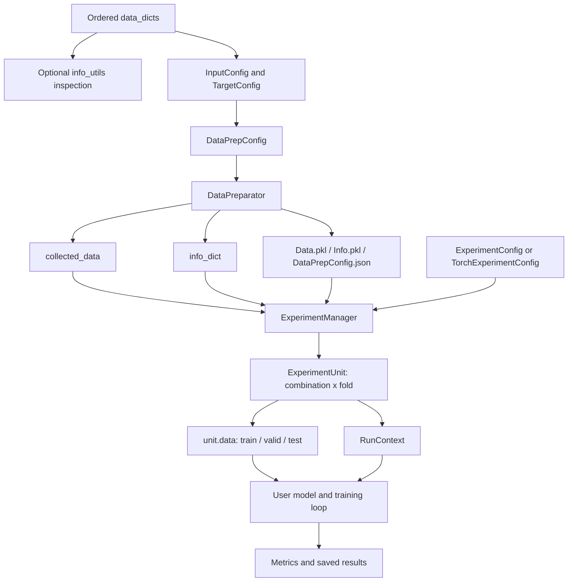

# FlexMM ワークフローガイド

[English](WORKFLOW.md) | [简体中文](WORKFLOW_zh-CN.md) | **日本語**

このドキュメントでは、順序付きサンプル辞書から fold ごとの実験単位と結果保存まで、FlexMM の完全なライフサイクルを説明します。

FlexMM は処理全体を 3 層に分離します。

1. `info_utils` による情報整理・確認
2. `data_prep` によるデータ準備
3. `experiment` による実験オーケストレーション

本フレームワークはモデル非依存です。データと実験条件を準備しますが、モデル構築と学習処理はユーザーが実装します。

---

## 1. アーキテクチャ概要



中心となる不変条件は次の通りです。

> 準備済みサンプル、ターゲット、分割割当、sequence anchor、実験条件のすべてが、元の順序付き `data_dicts` インデックスへ追跡可能でなければなりません。

---

## 2. 入力契約

### 2.1 順序付きサンプルごとに 1 つの辞書

`data_dicts` はリストであり、各要素は 1 サンプル、フレーム、発話、セグメント、trial、イベントなどを表します。

```python
sample_infos = [
    {
        "sample_id": "utt_0001",
        "speaker": "P01",
        "session": "S01",
        "audio": audio_feature_1,
        "text": text_feature_1,
        "label": "neutral",
    },
    {
        "sample_id": "utt_0002",
        "speaker": "P02",
        "session": "S01",
        "audio": audio_feature_2,
        "text": text_feature_2,
        "label": "positive",
    },
]
```

リスト順には意味があり、次を決定します。

- 元サンプルインデックス
- 時間的な隣接関係
- turn 境界
- 系列ウィンドウ
- 決定的な分割順序

### 2.2 推奨フィールド分類

| 分類 | 例 | 役割 |
|---|---|---|
| 安定識別子 | `sample_id` | 監査と外部参照。 |
| 分割/グループ参照 | `speaker`、`participant`、`group`、`session` | グループを考慮した分割と系列グループ化。 |
| 入力モダリティ | `audio`、`video`、`text`、`sensor` | モデル入力。 |
| ターゲット | `label`、`score`、`valence` | 教師信号。 |
| 補足情報 | timestamp、condition、source path | 任意のメタ情報・分析用途。 |

フレームワーク内部の整列は `sample_id` ではなく元リストインデックスに基づきます。それでも、分割結果を安全に確認・出力するため、安定した `sample_id` を推奨します。

### 2.3 対応する値形式

データ準備では次を扱えます。

- Python 数値スカラー
- NumPy 配列
- PyTorch が導入済みの場合の PyTorch tensor
- 数値リスト
- ネストしたリスト、非数値リスト
- 文字列、その他のスカラーオブジェクト

互換性のある数値は NumPy 配列に変換され、異種データはリストのまま保持されます。

設定したすべてのキーは、処理対象となる各辞書に存在する必要があります。密な配列へ変換する数値は、サンプル間で互換性のある shape を持つ必要があります。

---

## 3. サンプル情報の確認

`flexmm.info_utils` は `data_dicts` を直接処理し、データ準備設定を作成する前の確認に利用できます。

### 3.1 グループ値からインデックスへの写像

```python
from flexmm import info_utils

speaker_to_indexes = info_utils.get_ref_value2indexes(
    sample_infos,
    ref_key="speaker",
)
```

結果例：

```python
{
    "P01": [0, 1, 4],
    "P02": [2, 3],
}
```

### 3.2 グループ値とターゲットの関係

```python
speaker_to_labels = info_utils.get_ref_value2another(
    sample_infos,
    ref_key="speaker",
    another_key="label",
    unique_values=True,
)
```

重複値や頻度が重要な場合は `unique_values=False` を使用します。

### 3.3 Turn の構築

```python
turn_info = info_utils.get_turn2ref_value_and_indexes(
    sample_infos,
    ref_key="speaker",
)
```

次の場合に新しい turn を開始します。

- reference value が変わった場合
- 処理対象インデックスが前のインデックスと連続しなくなった場合

reference key による系列グループ化では、同じ話者の全出現を 1 つの長い系列へ結合せず、連続区間を turn として扱います。

### 3.4 隣接関係と区間

次の関数も利用できます。

- `get_ref_value2turn_indexes()`
- `get_ref_value2turns()`
- `get_ref_value2indexes_in_turns()`
- `get_ref_value2adjacent_ref_value()`
- `get_interval_split_indexes()`

これらは分析用 helper であり、`data_dicts` を変更しません。

---

## 4. データキーの設定

各モデル入力・ターゲットは key-level 設定で記述します。

### 4.1 `BaseConfig` の共通フィールド

| フィールド | 意味 |
|---|---|
| `keys` | 同じ設定を共有する 1 つまたは複数のキー。 |
| `seq_len_before` | anchor より前のコンテキスト数。 |
| `seq_len_after` | anchor より後のコンテキスト数。 |
| `step_offset` | 当該キーの相対整列 offset。 |
| `stride` | コンテキスト位置間の距離。 |
| `seq_pos_from_start` | 各範囲の先頭から除外する候補 anchor 数。 |
| `seq_pos_from_end` | 各範囲の末尾から除外する候補 anchor 数。 |
| `seq_padding` | 不完全ウィンドウを padding するか。 |
| `seq_padding_mode` | `"constant"` または `"edge"`。 |
| `seq_padding_value` | constant padding の値。 |
| `keep_batch_seq_dims` | 可能な限り batch/sequence 向けの次元を保持。 |
| `squeeze_singleton_dims` | 収集時に singleton 次元を除去。 |
| `standardize_data` | 実験時に入力を標準化するか。 |
| `standardize_scope` | `"split"` の学習データまたは `"all"` の全準備済みデータで統計量を推定。 |
| `dtype` | 要求する NumPy dtype。 |

### 4.2 入力

```python
from flexmm.data_prep import InputConfig

input_config = InputConfig(
    keys=["audio", "text"],
    seq_len_before=2,
    seq_len_after=2,
    seq_padding=True,
    standardize_data=True,
    standardize_scope="split",
    dtype="float32",
)
```

設定内に列挙した各入力キーへ同じ設定が独立に適用されます。

### 4.3 分類ターゲット

```python
from flexmm.data_prep import ClassificationTargetConfig

label_config = ClassificationTargetConfig(
    keys="label",
    convert_target_to_id=True,
)
```

分類ターゲットはスカラーまたはスカラー相当である必要があります。変換を有効にすると、準備済みターゲットは整数クラス ID となり、元ラベルから ID への写像は `info_dict` に保存されます。

### 4.4 回帰ターゲット

```python
from flexmm.data_prep import RegressionTargetConfig

score_config = RegressionTargetConfig(
    keys="score",
    stratified_bin_num=10,
    convert_target_to_bin=False,
)
```

回帰ビンは主に層化分割でターゲット分布を近似的に均衡させるために使います。`convert_target_to_bin=True` の場合、準備済みスカラー値もビン代表値へ置き換えます。

ベクトル・行列ターゲット：

```python
trajectory_config = RegressionTargetConfig(
    keys="trajectory",
    is_multi_dim=True,
)
```

多次元ターゲットは層化分割に利用できません。

---

## 5. データ準備パイプラインの設定

```python
from flexmm.data_prep import DataPrepConfig

prep_config = DataPrepConfig(
    focused_target_key="label",
    split_ref_key="speaker",
    split_dependency="independent",
    independent_split_valid_by="ref_key",
    split_mode="kfold",
    folds=5,
    train_valid_ratio=0.8,
    holdout_test_ratio=0.2,
    use_stratified_split=False,
    seq_group_mode="ref_key",
    seq_group_key="speaker",
    remove_test_train_overlap_range=True,
    remove_train_valid_overlap_range=False,
    remove_overlap_priority=["test", "train", "valid"],
    data_configs=[input_config, label_config],
    save_prepared_data=True,
    overwrite_data=True,
    store_dir="./ExperimentStore/demo",
)
```

### 5.1 Focused target

`focused_target_key` は次に用いるターゲットを指定します。

- 層化分割
- 有効 sequence anchor の決定
- sequence-index メタ情報の整列

省略時は、最初に設定されたターゲットを使用します。

### 5.2 Split reference key

`split_ref_key` は independent/dependent split のグループ変数です。一般的な例：

- speaker
- participant
- family/group
- conversation session
- recording ID

### 5.3 系列グループ化

#### Reference-key モード

```python
seq_group_mode="ref_key"
seq_group_key="speaker"
```

同じ reference value が連続する turn/区間を識別し、ウィンドウが境界を越えないようにします。

`seq_group_key=None` の場合は `split_ref_key` を使用します。

#### Index モード

```python
seq_group_mode="index"
```

順序付きデータ全体を 1 つの系列範囲として扱います。

#### カスタム範囲

```python
seq_ranges_custom=[(0, 100), (150, 220)]
```

範囲は半開区間で、`start` を含み `end` を含みません。

`include_seq_inter_ranges=True` を設定すると、未カバー区間を補い、データ全体をカスタム境界に沿って範囲分割します。

---

## 6. `DataPreparator` のライフサイクル

```python
from flexmm.data_prep import DataPreparator

preparator = DataPreparator(sample_infos, prep_config)
collected_data, info_dict = preparator.run()
```

`run()` は次の段階を順に実行します。

### Stage 0: 系列範囲とインデックス写像の初期化

系列境界を決定し、各範囲に含まれる初期インデックスを作成します。

2 方向の写像を保持します。

```python
id2ori_index
ori_index2id
```

系列フィルタにより元サンプルが除外された後、特に重要になります。

### Stage 1: キーごとの系列インデックス構築

各入力・ターゲットキーについて、次の設定からウィンドウを構築します。

- before/after 長
- stride
- 系列先頭/末尾からの anchor 除外
- padding
- キー固有 offset

すべてのキーは同数の準備済みサンプルを生成する必要があります。異なる場合は、モダリティとターゲットが静かにずれる前にエラーとなります。

### Stage 2: 整列済みデータの収集

各キーを `collected_data` に収集し、次の内部キーを追加します。

```python
from flexmm.data_prep import ORI_INDEX_KEY, SEQ_INDEX_KEY
```

- `ORI_INDEX_KEY`：各準備済みサンプルの元 anchor index
- `SEQ_INDEX_KEY`：focused target に対応する sequence-index list

### Stage 3: ターゲット処理

分類では次を生成します。

```python
target2id
id2target
target_stats
target2indexes
```

スカラー回帰では次を生成します。

```python
target_stats
target_bin_ranges
target2indexes
```

多次元回帰ではターゲット shape を記録します。

クラス ID や回帰ビンへの変換は `collected_data` のみに適用し、元の `data_dicts` は変更しません。

### Stage 4: train/validation/test 分割の作成

次節で説明する 3 分割方式のいずれかを実行します。

分割割当は**元サンプルインデックス**を参照します。

### Stage 5: 禁止された系列重複の除去

anchor が異なる split に属していても、ウィンドウは重なり得ます。

```text
train anchor 10 -> sequence [8, 9, 10, 11]
test anchor 12  -> sequence [10, 11, 12, 13]
```

test/train overlap removal を有効にすると、`remove_overlap_priority` に従って低優先度 anchor を除去します。

### Stage 6: `info_dict` の構築

```python
info_dict["index_split_folds"]
info_dict["ref_value_split_folds"]
info_dict["id2ori_index"]
info_dict["ori_index2id"]
info_dict["target_info"]
info_dict["input_shapes"]
```

### Stage 7: 準備成果物の保存

保存を有効にすると次を出力します。

```text
Data.pkl
Info.pkl
DataPrepConfig.json
```

`load_config()` で設定を復元し、`load_data()` ですべてを読み込めます。

---

## 7. 分割意味論の詳細

FlexMM では 2 つの判断を分離します。

1. **dependency semantics**：reference group が split 間でどう関係するか
2. **test mode**：holdout、k-fold、leave-one-out

### 7.1 Independent splitting

```python
split_dependency="independent"
```

test reference value は train/validation に現れません。

未知の話者、参加者、グループ、セッションへの汎化を評価する標準方式です。

#### Reference key 単位の validation

```python
independent_split_valid_by="ref_key"
```

train、validation、test の reference value は互いに独立です。

#### Index 単位の validation

```python
independent_split_valid_by="index"
```

test group は未知のままですが、train と validation は同じ非 test group のサンプルを含み得ます。

#### 明示的 reference override

```python
train_ref_values_override={0: ["P01", "P02"]}
valid_ref_values_override={0: ["P03"]}
test_ref_values_override={0: ["P04"]}
```

未知値、split 間重複、カバー範囲が検証されます。

### 7.2 Dependent splitting

```python
split_dependency="dependent"
independent_split_valid_by=None
```

各 reference group を内部で分割するため、同じ reference value が train、validation、test に存在できます。

被験者内・グループ内汎化を測る場合にのみ適しています。

dependent leave-one-out では、対応位置を各 fold で残すため、すべての group が同じ数の有効サンプルを持つ必要があります。

### 7.3 Unconstrained splitting

```python
split_dependency="none"
independent_split_valid_by=None
```

reference group を無視し、有効サンプルインデックス上で分割します。

### 7.4 Holdout

```python
split_mode="holdout"
holdout_test_ratio=0.2
```

1 つの test split を作成します。非空データでは最低 1 件を test に割り当て、可能な限り非 test データも残します。

### 7.5 K-fold

```python
split_mode="kfold"
folds=5
```

有効 reference value またはサンプルを fold に配分します。independent reference value 数が `folds` 未満の場合、実際の fold 数を減らします。

### 7.6 Leave-one-out

```python
split_mode="leave_one_out"
```

留保単位は分割意味論によって異なります。

- independent：fold ごとに 1 reference value
- dependent：fold ごとに全 reference group から対応位置を 1 件ずつ
- unconstrained：fold ごとに 1 sample

### 7.7 Stratification

```python
use_stratified_split=True
focused_target_key="label"
```

層化に対応するのは：

- スカラー分類ターゲット
- ビン化したスカラー回帰ターゲット

多次元ターゲットには対応しません。

層化は決定的で、各 target group 内の既存順序を利用します。ランダムな stratified splitter ではありません。

---

## 8. 3 つのインデックス空間

下流利用で最も重要な実装上のポイントです。

### 8.1 Original index

入力 `data_dicts` 上の位置：

```python
sample_infos[37]
```

split 関数はこの空間で動作します。

### 8.2 Sequence anchor

1 つの準備済み系列サンプルを代表する元インデックスです。anchor `37` の系列例：

```python
[35, 36, 37, 38, 39]
```

フィルタ、offset、カスタム範囲によって anchor は除外・移動される場合があります。

### 8.3 Prepared ID/position

`collected_data` 内の密な 0 始まり位置：

```python
collected_data["audio"][prepared_id]
```

元インデックス `[10, 20, 40]` のみが残った場合：

```python
ori_index2id == {10: 0, 20: 1, 40: 2}
id2ori_index == {0: 10, 1: 20, 2: 40}
```

`ExperimentManager` は元 split index を prepared position に変換してから `collected_data` を参照します。

両方を `RunContext` に保持します。

```python
context.split_indexes
context.prepared_split_indexes
```

写像が恒等であると明確に分かる場合を除き、圧縮済み `collected_data` を元インデックスで直接参照しないでください。

---

## 9. 準備済みデータの読み込み・再利用

### 9.1 2 段階ワークフロー

1 回準備します。

```python
DataPreparator(sample_infos, prep_config).run()
```

その後、複数実験で再利用します。

```python
exp_config = ExperimentConfig(
    experiment_input_keys=["audio", "text"],
    experiment_target_keys="label",
    load_prepared_data=True,
    store_dir="./ExperimentStore/demo",
)

manager = ExperimentManager(exp_config).setup()
```

同じ fold 上で複数モデルやハイパーパラメータを比較する場合に推奨します。

### 9.2 1 スクリプトワークフロー

```python
exp_config = ExperimentConfig(
    experiment_input_keys=["audio", "text"],
    experiment_target_keys="label",
    load_prepared_data=False,
    store_dir="./ExperimentStore/demo",
)

manager = ExperimentManager(
    exp_config=exp_config,
    data_dicts=sample_infos,
    data_prep_config=prep_config,
).setup()
```

manager が内部で `DataPreparator` を呼び出します。

---

## 10. 実験設定

### 10.1 入力組合せ

```python
from flexmm.experiment import ExperimentConfig

exp_config = ExperimentConfig(
    experiment_input_keys=["audio", "text", "video"],
    experiment_target_keys="label",
    generate_input_comb=True,
)
```

すべての非空組合せを生成します。

```text
[audio]
[text]
[video]
[audio, text]
[audio, video]
[text, video]
[audio, text, video]
```

全キーを 1 組合せとして使う場合：

```python
generate_input_comb=False
```

明示的に指定する場合：

```python
input_comb_custom=[
    ["audio"],
    ["text"],
    ["audio", "text"],
]
```

カスタム組合せは `experiment_input_keys` と `generate_input_comb` を上書きします。

### 10.2 組合せ名

```python
input_key_abbr={
    "audio": "A",
    "text": "T",
    "video": "V",
}
```

`['audio', 'text']` は次のようなディレクトリ名になります。

```text
Comb_A-T
```

### 10.3 再現性

```python
random_seed=42
random_seed_scope=["random", "numpy", "torch"]
```

manager は列挙された乱数系のみ seed 設定します。seed は各 `RunContext` にコピーされます。

モデル固有の非決定性、DataLoader worker、CUDA backend は学習スクリプト側の責任です。

---

## 11. `ExperimentManager`、`ExperimentUnit`、`RunContext`

### 11.1 Manager ライフサイクル

```python
manager = ExperimentManager(exp_config).setup()
```

`setup()` は：

1. 共有データを読み込む、または準備する
2. 要求された入力・ターゲットキーを検証する
3. 乱数 seed を初期化する
4. `ExpConfig.json` を保存する
5. manager を反復可能状態にする

manager は再反復可能です。

```python
for unit in manager:
    ...

for unit in manager:
    ...  # 再び完全に反復
```

各反復は既に消費された generator ではなく、新しい条件データを生成します。

### 11.2 Unit の生成

各条件に 1 つの `ExperimentUnit` を生成します。

```text
input combination × fold
```

```python
for unit in manager:
    train_data = unit.data["train"]
    valid_data = unit.data["valid"]
    test_data = unit.data["test"]
```

### 11.3 Run context

```python
context = unit.context
```

| フィールド | 意味 |
|---|---|
| `fold` | 準備済み分割の fold 識別子。 |
| `comb_index` | 実験計画内の入力組合せ位置。 |
| `comb_name` | ファイル名に安全な組合せ名。 |
| `input_comb` | 有効な入力キー。 |
| `target_keys` | 有効なターゲットキー。 |
| `split_indexes` | train/valid/test の元インデックス。 |
| `prepared_split_indexes` | train/valid/test の準備後位置。 |
| `ref_value_splits` | 各 split に割り当てられた speaker/group/session 値。 |
| `standardization_info` | 各入力の平均、標準偏差、scope、source。 |
| `info_dict` | データ準備で生成された共有情報。 |
| `exp_config` | 実験設定。 |
| `data_prep_config` | データ準備設定。 |
| `output_dir` | 現在条件の推奨出力先。 |
| `seed` | 基本乱数 seed。 |
| `user_extras` | ユーザー定義情報。 |

FlexMM 固有設定ではないが学習に必要な安定情報は `user_extras` で渡します。

```python
manager = ExperimentManager(
    exp_config,
    user_extras={
        "model_family": "late_fusion",
        "project_name": "emotion_recognition",
    },
)
```

---

## 12. 標準化の挙動

標準化は各 `ExperimentUnit` 作成時に行い、共有 `collected_data` は変更しません。

### 12.1 Fold 単位の標準化

```python
standardize_data=True
standardize_scope="split"
```

各入力キー・fold について：

1. 現在の train split を収集
2. train のみから特徴次元ごとの平均・標準偏差を計算
3. 同じ統計量を train、validation、test に適用
4. 分散 0 の次元を安全に 0 へ写像
5. `context.standardization_info` に保存

validation/test leakage を防止します。

### 12.2 グローバル標準化

```python
standardize_scope="all"
```

全準備済みサンプルから統計量を算出します。意図的なデプロイ前処理として使う場合はありますが、通常の評価では情報リークとなるため既定には向きません。

### 12.3 対応方式

現在実装されているのは z-score です。`standardize_method="minmax"` は型として存在しますが、`ExperimentManager` はまだ適用しません。

---

## 13. データ出力レベル

### 13.1 Raw 辞書

```python
data_level="raw"
```

各 split は辞書です。

```python
unit.data["train"]["audio"]
unit.data["train"]["label"]
```

scikit-learn、独自 batching、非 PyTorch パイプラインに利用できます。

### 13.2 PyTorch Dataset

```python
data_level="dataset"
data_representation="pt"
```

各 split は `TorchDataset` となり、1 サンプルごとに辞書を返します。

### 13.3 PyTorch DataLoader

```python
from flexmm.experiment import TorchExperimentConfig

exp_config = TorchExperimentConfig(
    ...,
    data_level="dataloader",
    data_representation="pt",
    train_batch_size=32,
    valid_batch_size=64,
    test_batch_size=64,
    shuffle_train_data=True,
    shuffle_valid_data=False,
    shuffle_test_data=False,
)
```

DataLoader dataset は CPU 上に置かれます。学習ループ内で batch を device に移動してください。

---

## 14. End-to-end PyTorch スケルトン

```python
import torch

from flexmm.data_prep import (
    ClassificationTargetConfig,
    DataPrepConfig,
    InputConfig,
)
from flexmm.experiment import ExperimentManager, TorchExperimentConfig

prep_config = DataPrepConfig(
    focused_target_key="label",
    split_ref_key="speaker",
    split_dependency="independent",
    independent_split_valid_by="ref_key",
    split_mode="kfold",
    folds=5,
    data_configs=[
        InputConfig(
            keys=["audio", "text"],
            standardize_data=True,
            standardize_scope="split",
            dtype="float32",
        ),
        ClassificationTargetConfig(
            keys="label",
            convert_target_to_id=True,
        ),
    ],
    store_dir="./ExperimentStore/demo",
)

exp_config = TorchExperimentConfig(
    experiment_input_keys=["audio", "text"],
    experiment_target_keys="label",
    generate_input_comb=True,
    input_key_abbr={"audio": "A", "text": "T"},
    load_prepared_data=False,
    data_level="dataloader",
    data_representation="pt",
    store_dir="./ExperimentStore/demo",
    random_seed=42,
    train_batch_size=32,
    valid_batch_size=64,
    test_batch_size=64,
)

manager = ExperimentManager(
    exp_config=exp_config,
    data_dicts=sample_infos,
    data_prep_config=prep_config,
).setup()

device = torch.device("cuda" if torch.cuda.is_available() else "cpu")

for unit in manager:
    context = unit.context
    model = build_model(
        input_comb=context.input_comb,
        info_dict=context.info_dict,
    ).to(device)

    optimizer = torch.optim.AdamW(model.parameters(), lr=1e-3)

    for batch in unit.data["train"]:
        batch = {
            key: value.to(device) if isinstance(value, torch.Tensor) else value
            for key, value in batch.items()
        }
        optimizer.zero_grad()
        logits = model(batch)
        loss = calculate_loss(logits, batch["label"])
        loss.backward()
        optimizer.step()

    predictions, targets = evaluate_model(model, unit.data["test"], device)
    metrics = manager.get_result(predictions, targets, task_type="c")
    manager.save_result(metrics, context=context)
```

次は意図的にユーザー実装です。

- `build_model()`
- `calculate_loss()`
- `evaluate_model()`

FlexMM は実験準備を特定アーキテクチャや trainer に結び付けません。

---

## 15. 評価指標と結果処理

### 15.1 分類指標

```python
metrics = manager.get_result(pred, true, task_type="c")
```

予測の最終次元がクラス score の場合、自動的に `argmax` を適用します。

- `acc`
- `f1_macro`
- `f1_weighted`
- `precision`
- `recall`
- `pearson_correlation`
- `confusion_matrix`
- `true_list`
- `pred_list`

### 15.2 回帰指標

```python
metrics = manager.get_result(pred, true, task_type="r")
```

- `mae`
- `mse`
- `rmse`
- `pearson_correlation`
- `true_list`
- `pred_list`

### 15.3 結果保存

条件ごとの保存：

```python
manager.save_result(metrics, context=unit.context)
```

グローバル保存：

```python
manager.save_result(all_results)
```

既定パス：

```text
<store_dir>/Comb_<combination>/fold_<fold>/ExpResult.pkl
<store_dir>/ExpResult.pkl
```

`context.output_dir` の下に checkpoint、ログ、JSON summary なども保存できます。

---

## 16. シリアライズと再現性

### 16.1 データ準備成果物

```text
Data.pkl
Info.pkl
DataPrepConfig.json
```

### 16.2 実験成果物

```text
ExpConfig.json
```

### 16.3 実行ごとの成果物

```text
Comb_<combination>/fold_<fold>/
```

### 16.4 再現できる情報

保存設定・情報には次が含まれます。

- 入力/ターゲットキー設定
- 系列設定
- 分割方式と割当
- ターゲット写像・統計
- 元/準備後インデックス写像
- 入力組合せ
- 乱数 seed 設定

モデル結果を完全再現するには、さらに次を保存してください。

- ソースコード version/commit
- モデル設定
- optimizer・scheduler 設定
- パッケージ version
- model checkpoint
- ハードウェア/backend の決定性設定

---

## 17. 拡張ポイント

### 17.1 カスタム split 後処理

`DataPreparator` は次を受け取ります。

```python
split_postprocess_fn
```

callable には次が渡されます。

```python
index_split_folds, ref_value_split_folds
```

変更後の 2 オブジェクトを返せます。組み込み split と overlap removal 後のドメイン固有除外に利用できます。

### 17.2 明示的 split override

```python
index_split_dict_override={
    0: {
        "train": [...],
        "valid": [...],
        "test": [...],
    }
}
```

ベンチマーク固定分割や外部生成分割に利用できます。

### 17.3 ユーザー実行情報

`user_extras` を使い、フレームワーク設定へ追加せずにプロジェクト・モデル情報を各 run へ渡せます。

### 17.4 他のモデル環境

`data_level="raw"` は次に利用できます。

- scikit-learn
- XGBoost/LightGBM
- JAX
- 独自 NumPy パイプライン
- 外部管理 data loader

### 17.5 大規模 Feature Store

現在の API は `data_dicts` から値を収集します。将来の `FeatureStore` や lazy dataset adapter では、同じ準備メタ情報を維持しつつ、`sample_id` または path から大型モダリティを必要時に読み込めます。

---

## 18. よくある落とし穴

### 1. 準備済み配列を元インデックスで参照する

```python
collected_data[key][original_index]
```

フィルタ後は正しくない場合があります。`ori_index2id` または `ExperimentManager` を利用してください。

### 2. validation/test 標準化リーク

```python
standardize_scope="split"
```

validation/test 自身の統計量で個別に標準化しないでください。

### 3. 意図しない被験者リーク

未知被験者評価では：

```python
split_dependency="independent"
independent_split_valid_by="ref_key"
```

dependent や index-based validation は別の研究課題を評価します。

### 4. Anchor が分離されていても系列が重なる

異なる anchor が同じ raw index を含み得ます。時間窓では test/train overlap removal を有効にしてください。

### 5. 暗黙のランダム化を期待する

FlexMM の split は順序を保持し、自動 shuffle しません。

### 6. Dependent split で independent 専用設定を残す

```python
split_dependency="dependent"
independent_split_valid_by=None
```

`split_dependency="none"` も同様です。

### 7. 多次元ターゲットで層化する

多次元ターゲットはスカラー strata を定義できません。層化を無効にするか、別のスカラー focused target を指定してください。

### 8. `standardize_method="minmax"` が実装済みだと考える

現在の runtime は z-score のみです。

### 9. 信頼できない pickle を読み込む

`Data.pkl`、`Info.pkl`、結果ファイルは pickle です。信頼できない提供元のファイルを読み込まないでください。

---

## 19. 公開リリース前チェックリスト

- Python と依存関係を記述した `pyproject.toml` を追加
- `LICENSE` を追加
- `CITATION.cff` を追加
- 公開予定オブジェクトを `flexmm/__init__.py` から公開
- 全 split mode と sequence overlap rule の unit test を追加
- 小さな実行可能サンプルデータ/スクリプトを追加
- Python 3.9+ の CI を追加
- `standardize_method="minmax"` を削除するか実装するか決定
- 安定した versioning policy を文書化
- 生成 pickle や非公開データを commit しない

---

## 20. 全体像を一言で理解する

```text
Ordered sample dictionaries
    ↓
Key configs describe how each input/target behaves
    ↓
DataPrepConfig describes sequence and split semantics
    ↓
DataPreparator creates aligned data + traceable metadata
    ↓
ExperimentConfig describes combinations and output level
    ↓
ExperimentManager yields one ExperimentUnit per combination × fold
    ↓
RunContext carries all run-specific information
    ↓
Your model/training loop produces and saves results
```
