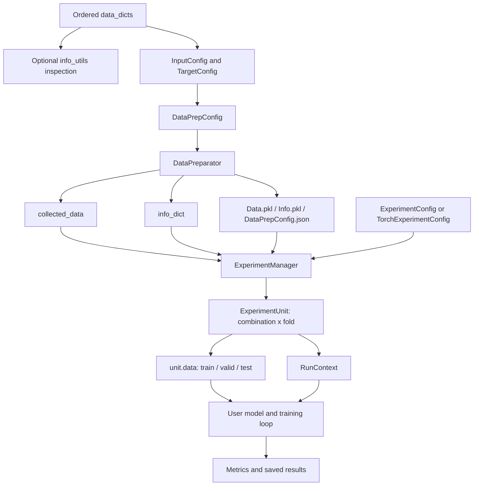

# FlexMM 完整流程指南

[English](../WORKFLOW.md) | **简体中文** | [日本語](WORKFLOW_ja.md)

本文档说明 FlexMM 的完整生命周期：从按顺序排列的样本字典列表，到每个 fold 对应的实验单元和结果保存。

FlexMM 将整个流程划分为三个层次：

1. 使用 `info_utils` 组织和查询信息；
2. 使用 `data_prep` 完成数据准备；
3. 使用 `experiment` 编排实验。

该框架与模型无关。它负责准备数据与实验条件，但模型构建和训练流程由用户实现。

---

## 1. 架构概览



整个框架最核心的不变量是：

> 每个准备后的样本、目标值、划分结果、序列 anchor 和实验条件，都必须能够追溯到原始有序 `data_dicts` 中的索引。

---

## 2. 输入约定

### 2.1 每个有序样本对应一个字典

`data_dicts` 是一个列表，其中每个元素表示一个样本、帧、话语、片段、trial 或事件。

```python
sample_infos = [
    {
        "sample_id": "utt_0001",
        "speaker": "P01",
        "session": "S01",
        "audio": audio_feature_1,
        "text": text_feature_1,
        "label": "neutral",
    },
    {
        "sample_id": "utt_0002",
        "speaker": "P02",
        "session": "S01",
        "audio": audio_feature_2,
        "text": text_feature_2,
        "label": "positive",
    },
]
```

列表顺序具有语义意义，因为它决定：

- 原始样本索引；
- 时间上的相邻关系；
- turn 边界；
- 序列窗口；
- 确定性的数据划分顺序。

### 2.2 推荐的字段类别

| 类别 | 示例 | 作用 |
|---|---|---|
| 稳定标识符 | `sample_id` | 审计与外部引用。 |
| 划分/分组 reference | `speaker`、`participant`、`group`、`session` | 组感知划分与序列分组。 |
| 输入模态 | `audio`、`video`、`text`、`sensor` | 模型输入。 |
| 目标值 | `label`、`score`、`valence` | 监督信号。 |
| 描述信息 | timestamp、condition、source path | 可选元信息和分析字段。 |

框架内部根据原始列表索引完成对齐，而不是依赖 `sample_id`。不过，仍强烈建议提供稳定的 `sample_id`，以便用户安全地检查或导出数据划分结果。

### 2.3 支持的值类型

数据准备阶段可以收集：

- Python 数值标量；
- NumPy 数组；
- 安装 PyTorch 时的 PyTorch tensor；
- 数值列表；
- 嵌套列表或非数值列表；
- 字符串和其他标量对象。

兼容的数值内容会被转换为 NumPy 数组，异构数据则保留为列表。

所有配置中使用的键都必须出现在每个被处理的字典中。需要组成稠密数组的数值内容应具有兼容形状。

---

## 3. 检查样本信息

`flexmm.info_utils` 直接对 `data_dicts` 工作，适合在创建数据准备配置之前检查数据结构。

### 3.1 从组值映射到索引

```python
from flexmm import info_utils

speaker_to_indexes = info_utils.get_ref_value2indexes(
    sample_infos,
    ref_key="speaker",
)
```

示例结果：

```python
{
    "P01": [0, 1, 4],
    "P02": [2, 3],
}
```

### 3.2 从组值映射到目标值

```python
speaker_to_labels = info_utils.get_ref_value2another(
    sample_infos,
    ref_key="speaker",
    another_key="label",
    unique_values=True,
)
```

当重复值及其频数具有意义时，使用 `unique_values=False`。

### 3.3 构造 turn

```python
turn_info = info_utils.get_turn2ref_value_and_indexes(
    sample_infos,
    ref_key="speaker",
)
```

在以下情况开始新的 turn：

- reference value 发生变化；或
- 当前处理索引与前一个索引不再连续。

这一点很重要：使用 reference key 进行序列分组时，框架依据连续区间构造 turn，而不会把同一说话人在不同位置出现的全部内容合并为一个超长序列。

### 3.4 相邻关系与区间

模块还提供：

- `get_ref_value2turn_indexes()`；
- `get_ref_value2turns()`；
- `get_ref_value2indexes_in_turns()`；
- `get_ref_value2adjacent_ref_value()`；
- `get_interval_split_indexes()`。

这些函数用于分析，不会修改 `data_dicts`。

---

## 4. 配置数据键

每个模型输入或目标值都由一个 key-level 配置描述。

### 4.1 `BaseConfig` 的共享字段

输入配置和目标配置都会继承以下字段：

| 字段 | 含义 |
|---|---|
| `keys` | 使用相同配置的一个键或一组键。 |
| `seq_len_before` | anchor 之前的上下文位置数量。 |
| `seq_len_after` | anchor 之后的上下文位置数量。 |
| `step_offset` | 当前键相对于公共 anchor 的对齐偏移。 |
| `stride` | 上下文位置之间的索引距离。 |
| `seq_pos_from_start` | 从每个范围开头排除的候选 anchor 数。 |
| `seq_pos_from_end` | 从每个范围结尾排除的候选 anchor 数。 |
| `seq_padding` | 是否为不完整窗口 padding。 |
| `seq_padding_mode` | `"constant"` 或 `"edge"`。 |
| `seq_padding_value` | constant padding 使用的值。 |
| `keep_batch_seq_dims` | 尽可能保留 batch/sequence 形式的维度。 |
| `squeeze_singleton_dims` | 收集数据时是否去除单元素维度。 |
| `standardize_data` | 是否在实验阶段对输入进行标准化。 |
| `standardize_scope` | 使用 `"split"` 训练集或 `"all"` 全部准备后数据拟合统计量。 |
| `dtype` | 期望的 NumPy dtype。 |

### 4.2 输入

```python
from flexmm.data_prep import InputConfig

input_config = InputConfig(
    keys=["audio", "text"],
    seq_len_before=2,
    seq_len_after=2,
    seq_padding=True,
    standardize_data=True,
    standardize_scope="split",
    dtype="float32",
)
```

同一个配置中列出的每个输入键会独立应用这些设置。

### 4.3 分类目标

```python
from flexmm.data_prep import ClassificationTargetConfig

label_config = ClassificationTargetConfig(
    keys="label",
    convert_target_to_id=True,
)
```

分类目标必须是标量或可转换为标量的形式。启用转换后，准备后的目标值会变为整数类别 ID，原始标签到 ID 的映射保存在 `info_dict` 中。

### 4.4 回归目标

```python
from flexmm.data_prep import RegressionTargetConfig

score_config = RegressionTargetConfig(
    keys="score",
    stratified_bin_num=10,
    convert_target_to_bin=False,
)
```

回归分箱主要用于在分层划分时近似平衡目标分布。设置 `convert_target_to_bin=True` 后，准备后的标量回归值也会被替换为相应 bin 的代表值。

对于向量或矩阵目标：

```python
trajectory_config = RegressionTargetConfig(
    keys="trajectory",
    is_multi_dim=True,
)
```

多维目标不能用于分层划分。

---

## 5. 配置数据准备流程

```python
from flexmm.data_prep import DataPrepConfig

prep_config = DataPrepConfig(
    focused_target_key="label",
    split_ref_key="speaker",
    split_dependency="independent",
    independent_split_valid_by="ref_key",
    split_mode="kfold",
    folds=5,
    train_valid_ratio=0.8,
    holdout_test_ratio=0.2,
    use_stratified_split=False,
    seq_group_mode="ref_key",
    seq_group_key="speaker",
    remove_test_train_overlap_range=True,
    remove_train_valid_overlap_range=False,
    remove_overlap_priority=["test", "train", "valid"],
    data_configs=[input_config, label_config],
    save_prepared_data=True,
    overwrite_data=True,
    store_dir="./ExperimentStore/demo",
)
```

### 5.1 Focused target

`focused_target_key` 指定用于以下操作的目标键：

- 分层划分；
- 确定有效 sequence anchor；
- 对齐 sequence-index 元信息。

未指定时，默认使用第一个配置的目标键。

### 5.2 Split reference key

`split_ref_key` 定义 independent 或 dependent split 使用的分组变量。常见选择包括：

- speaker；
- participant；
- family/group；
- conversation session；
- recording ID。

### 5.3 序列分组

#### Reference-key 模式

```python
seq_group_mode="ref_key"
seq_group_key="speaker"
```

数据准备器会识别 reference value 相同的连续 turn/区间，并阻止序列窗口跨越这些边界。

如果 `seq_group_key=None`，则使用 `split_ref_key`。

#### Index 模式

```python
seq_group_mode="index"
```

将完整的有序数据集视为一个序列范围。

#### 自定义范围

```python
seq_ranges_custom=[(0, 100), (150, 220)]
```

范围采用半开区间：`(start, end)` 包含 `start`，不包含 `end`。

`include_seq_inter_ranges=True` 会补充未覆盖区间，使完整数据集围绕自定义边界被划分为多个范围。

---

## 6. `DataPreparator` 生命周期

```python
from flexmm.data_prep import DataPreparator

preparator = DataPreparator(sample_infos, prep_config)
collected_data, info_dict = preparator.run()
```

`run()` 会按顺序执行以下阶段。

### 阶段 0：初始化序列范围与索引映射

数据准备器先确定序列边界，并生成这些范围覆盖的初始索引列表。

它维护两个方向的映射：

```python
id2ori_index
ori_index2id
```

当 sequence filtering 删除一部分原始样本后，这两个映射尤其重要。

### 阶段 1：为每个键构造序列索引

数据准备器根据以下配置为每个输入和目标键构造窗口：

- before/after 长度；
- stride；
- 从序列开头/结尾排除 anchor；
- padding；
- 键特定 offset。

所有键必须生成相同数量的准备后样本。如果数量不一致，流程会提前报错，而不是静默地造成模态与目标错位。

### 阶段 2：收集对齐后的数据

所有配置键都会被收集到 `collected_data`。

同时添加两个内部键：

```python
from flexmm.data_prep import ORI_INDEX_KEY, SEQ_INDEX_KEY
```

- `ORI_INDEX_KEY` 保存每个准备后样本的原始 anchor 索引；
- `SEQ_INDEX_KEY` 保存 focused target 对应的序列索引列表。

### 阶段 3：处理目标值

对于分类任务，数据准备器创建：

```python
target2id
id2target
target_stats
target2indexes
```

对于标量回归任务，创建：

```python
target_stats
target_bin_ranges
target2indexes
```

对于多维回归任务，记录目标形状。

用户要求的类别 ID 转换或回归分箱转换只会应用于 `collected_data`，不会修改原始 `data_dicts`。

### 阶段 4：生成 train/validation/test 划分

数据准备器调用下一节介绍的三种划分策略之一。

划分结果保存的是**原始样本索引**。

### 阶段 5：移除不允许的序列重叠

即使 anchor 属于不同 split，窗口本身仍可能重叠。例如：

```text
train anchor 10 -> sequence [8, 9, 10, 11]
test anchor 12  -> sequence [10, 11, 12, 13]
```

启用 test/train overlap removal 后，会按照 `remove_overlap_priority` 删除低优先级 anchor。

### 阶段 6：组装 `info_dict`

`info_dict` 包含：

```python
info_dict["index_split_folds"]
info_dict["ref_value_split_folds"]
info_dict["id2ori_index"]
info_dict["ori_index2id"]
info_dict["target_info"]
info_dict["input_shapes"]
```

### 阶段 7：保存准备结果

启用保存后，生成：

```text
Data.pkl
Info.pkl
DataPrepConfig.json
```

可以使用 `load_config()` 重建配置，并使用 `load_data()` 读取全部三个产物。

---

## 7. 数据划分语义详解

FlexMM 将数据划分分成两个独立决定：

1. **dependency semantics**：reference group 在不同 split 之间如何关联；
2. **test mode**：holdout、k-fold 或 leave-one-out。

### 7.1 Independent splitting

```python
split_dependency="independent"
```

测试 reference value 不会出现在 train 或 validation 中。

这是评价对未见说话人、参与者、组别或会话泛化能力时的默认选择。

#### 按 reference key 生成独立 validation

```python
independent_split_valid_by="ref_key"
```

train、validation、test 使用互不重叠的 reference value。

#### 按 index 生成 validation

```python
independent_split_valid_by="index"
```

测试组仍然完全未见，但 train 和 validation 中可以出现来自同一非测试组的样本。

#### 显式 reference override

可以为每个 fold 或所有 fold 提供 reference value：

```python
train_ref_values_override={0: ["P01", "P02"]}
valid_ref_values_override={0: ["P03"]}
test_ref_values_override={0: ["P04"]}
```

override 会检查未知值、不同 split 之间的重叠和覆盖完整性。

### 7.2 Dependent splitting

```python
split_dependency="dependent"
independent_split_valid_by=None
```

每个 reference group 都会在内部被划分，因此同一个 reference value 可以同时出现在 train、validation 和 test 中。

只有当研究问题关注被试内或组内泛化时，才适合使用该方式。

对于 dependent leave-one-out，各 reference group 必须包含相同数量的有效样本，才能在每个 fold 中留下对应位置的样本。

### 7.3 Unconstrained splitting

```python
split_dependency="none"
independent_split_valid_by=None
```

划分忽略 reference group，直接在有效样本索引上操作。

### 7.4 Holdout

```python
split_mode="holdout"
holdout_test_ratio=0.2
```

只生成一个测试划分。对于非空数据，至少会分配一个测试项；在条件允许时也会保留非测试数据。

### 7.5 K-fold

```python
split_mode="kfold"
folds=5
```

有效 reference value 或样本会被分配到指定数量的 fold。如果 independent reference value 数量小于 `folds`，实际 fold 数会自动降低。

### 7.6 Leave-one-out

```python
split_mode="leave_one_out"
```

被留出的单元取决于 split semantics：

- independent：每个 fold 留出一个 reference value；
- dependent：每个 fold 从所有 reference group 中各留出一个对应位置的样本；
- unconstrained：每个 fold 留出一个样本。

### 7.7 Stratification

```python
use_stratified_split=True
focused_target_key="label"
```

分层支持：

- 标量分类目标；
- 分箱后的标量回归目标。

多维目标不支持分层。

分层过程是确定性的，并保留每个 target group 内部已有的顺序。它不是随机 stratified splitter。

---

## 8. 理解三种索引空间

这是下游使用者最需要注意的实现细节。

### 8.1 Original index

输入 `data_dicts` 列表中的位置：

```python
sample_infos[37]
```

所有 split 函数都在该索引空间中工作。

### 8.2 Sequence anchor

代表一个准备后序列样本的原始索引。以 anchor `37` 为中心的序列可能是：

```python
[35, 36, 37, 38, 39]
```

过滤、offset 和自定义范围可能会删除或移动 anchor。

### 8.3 Prepared ID/position

`collected_data` 中稠密的零起始位置：

```python
collected_data["audio"][prepared_id]
```

如果数据准备后只保留原始索引 `[10, 20, 40]`，则：

```python
ori_index2id == {10: 0, 20: 1, 40: 2}
id2ori_index == {0: 10, 1: 20, 2: 40}
```

`ExperimentManager` 会先把原始 split index 转换为 prepared position，再索引 `collected_data`。

两种形式都保存在 `RunContext` 中：

```python
context.split_indexes
context.prepared_split_indexes
```

除非明确知道映射为恒等映射，否则不要直接使用原始 split index 索引压缩后的 `collected_data`。

---

## 9. 加载或复用准备后数据

### 9.1 两阶段流程

先准备一次：

```python
DataPreparator(sample_infos, prep_config).run()
```

随后运行多个实验：

```python
exp_config = ExperimentConfig(
    experiment_input_keys=["audio", "text"],
    experiment_target_keys="label",
    load_prepared_data=True,
    store_dir="./ExperimentStore/demo",
)

manager = ExperimentManager(exp_config).setup()
```

当需要在同一批准备后 fold 上比较多个模型架构或超参数设置时，推荐使用该方式。

### 9.2 单脚本流程

```python
exp_config = ExperimentConfig(
    experiment_input_keys=["audio", "text"],
    experiment_target_keys="label",
    load_prepared_data=False,
    store_dir="./ExperimentStore/demo",
)

manager = ExperimentManager(
    exp_config=exp_config,
    data_dicts=sample_infos,
    data_prep_config=prep_config,
).setup()
```

manager 会在内部调用 `DataPreparator`。

---

## 10. 实验配置

### 10.1 输入组合

```python
from flexmm.experiment import ExperimentConfig

exp_config = ExperimentConfig(
    experiment_input_keys=["audio", "text", "video"],
    experiment_target_keys="label",
    generate_input_comb=True,
)
```

会生成所有非空组合：

```text
[audio]
[text]
[video]
[audio, text]
[audio, video]
[text, video]
[audio, text, video]
```

如果只运行一个完整组合：

```python
generate_input_comb=False
```

也可以显式指定：

```python
input_comb_custom=[
    ["audio"],
    ["text"],
    ["audio", "text"],
]
```

自定义组合会覆盖 `experiment_input_keys` 和 `generate_input_comb`。

### 10.2 组合名称

```python
input_key_abbr={
    "audio": "A",
    "text": "T",
    "video": "V",
}
```

组合 `['audio', 'text']` 会生成类似目录：

```text
Comb_A-T
```

### 10.3 可复现性

```python
random_seed=42
random_seed_scope=["random", "numpy", "torch"]
```

manager 只会初始化列出的随机系统。随机种子会复制到每个 `RunContext`。

模型自身的非确定性、DataLoader worker 和 CUDA backend 行为仍由训练脚本负责。

---

## 11. `ExperimentManager`、`ExperimentUnit` 与 `RunContext`

### 11.1 Manager 生命周期

```python
manager = ExperimentManager(exp_config).setup()
```

`setup()` 会：

1. 加载或准备共享数据；
2. 检查请求的输入键和目标键；
3. 初始化随机种子；
4. 保存 `ExpConfig.json`；
5. 将 manager 标记为可迭代状态。

manager 可以重复迭代：

```python
for unit in manager:
    ...

for unit in manager:
    ...  # 再次完整遍历
```

每次迭代都会构建新的条件数据，而不是返回已经消耗过的 generator。

### 11.2 Unit 生成

manager 会为每个以下条件生成一个 `ExperimentUnit`：

```text
input combination × fold
```

```python
for unit in manager:
    train_data = unit.data["train"]
    valid_data = unit.data["valid"]
    test_data = unit.data["test"]
```

### 11.3 Run context

```python
context = unit.context
```

| 字段 | 含义 |
|---|---|
| `fold` | 数据准备阶段保存的 fold 标识。 |
| `comb_index` | 输入组合在实验计划中的位置。 |
| `comb_name` | 可安全用于文件系统的组合名称。 |
| `input_comb` | 当前启用的输入键。 |
| `target_keys` | 当前启用的目标键。 |
| `split_indexes` | train/valid/test 对应的原始索引。 |
| `prepared_split_indexes` | train/valid/test 对应的准备后位置。 |
| `ref_value_splits` | 分配到各 split 的 speaker/group/session 值。 |
| `standardization_info` | 每个标准化输入的均值、标准差、scope 和来源。 |
| `info_dict` | 数据准备阶段生成的共享信息。 |
| `exp_config` | 实验配置。 |
| `data_prep_config` | 数据准备配置。 |
| `output_dir` | 当前实验条件推荐的输出目录。 |
| `seed` | 基础实验随机种子。 |
| `user_extras` | 用户自定义信息。 |

可使用 `user_extras` 携带训练需要但不属于 FlexMM 固有配置的稳定信息：

```python
manager = ExperimentManager(
    exp_config,
    user_extras={
        "model_family": "late_fusion",
        "project_name": "emotion_recognition",
    },
)
```

---

## 12. 标准化行为

标准化在创建每个 `ExperimentUnit` 时执行，共享的 `collected_data` 不会被修改。

### 12.1 Fold-level 标准化

```python
standardize_data=True
standardize_scope="split"
```

对于每个输入键和 fold：

1. 收集当前训练集；
2. 使用训练数据计算逐特征均值和标准差；
3. 将同一统计量应用于 train、validation 和 test；
4. 安全地将零方差维度映射为零；
5. 将统计量保存在 `context.standardization_info`。

该方式可以避免 validation/test leakage。

### 12.2 全局标准化

```python
standardize_scope="all"
```

统计量由全部准备后样本计算。它可能适合某些明确规定的部署预处理流程，但在常规实验评价中会泄漏信息，因此不应作为报告结果时的默认选择。

### 12.3 方法支持

当前运行时实现的是 z-score 标准化。配置类型中保留了 `standardize_method="minmax"`，但 `ExperimentManager` 尚未执行 min-max 标准化。

---

## 13. 数据输出层级

### 13.1 原始字典

```python
data_level="raw"
```

每个 split 是一个字典：

```python
unit.data["train"]["audio"]
unit.data["train"]["label"]
```

适用于 scikit-learn、自定义 batching 或非 PyTorch 流程。

### 13.2 PyTorch Dataset

```python
data_level="dataset"
data_representation="pt"
```

每个 split 是一个 `TorchDataset`，每次返回单个样本字典。

### 13.3 PyTorch DataLoader

```python
from flexmm.experiment import TorchExperimentConfig

exp_config = TorchExperimentConfig(
    ...,
    data_level="dataloader",
    data_representation="pt",
    train_batch_size=32,
    valid_batch_size=64,
    test_batch_size=64,
    shuffle_train_data=True,
    shuffle_valid_data=False,
    shuffle_test_data=False,
)
```

DataLoader 对应的 dataset 保持在 CPU 上。请在训练循环中把 batch 移动到目标 device。

---

## 14. 端到端 PyTorch 骨架

```python
import torch

from flexmm.data_prep import (
    ClassificationTargetConfig,
    DataPrepConfig,
    InputConfig,
)
from flexmm.experiment import ExperimentManager, TorchExperimentConfig

prep_config = DataPrepConfig(
    focused_target_key="label",
    split_ref_key="speaker",
    split_dependency="independent",
    independent_split_valid_by="ref_key",
    split_mode="kfold",
    folds=5,
    data_configs=[
        InputConfig(
            keys=["audio", "text"],
            standardize_data=True,
            standardize_scope="split",
            dtype="float32",
        ),
        ClassificationTargetConfig(
            keys="label",
            convert_target_to_id=True,
        ),
    ],
    store_dir="./ExperimentStore/demo",
)

exp_config = TorchExperimentConfig(
    experiment_input_keys=["audio", "text"],
    experiment_target_keys="label",
    generate_input_comb=True,
    input_key_abbr={"audio": "A", "text": "T"},
    load_prepared_data=False,
    data_level="dataloader",
    data_representation="pt",
    store_dir="./ExperimentStore/demo",
    random_seed=42,
    train_batch_size=32,
    valid_batch_size=64,
    test_batch_size=64,
)

manager = ExperimentManager(
    exp_config=exp_config,
    data_dicts=sample_infos,
    data_prep_config=prep_config,
).setup()

device = torch.device("cuda" if torch.cuda.is_available() else "cpu")

for unit in manager:
    context = unit.context
    model = build_model(
        input_comb=context.input_comb,
        info_dict=context.info_dict,
    ).to(device)

    optimizer = torch.optim.AdamW(model.parameters(), lr=1e-3)

    for batch in unit.data["train"]:
        batch = {
            key: value.to(device) if isinstance(value, torch.Tensor) else value
            for key, value in batch.items()
        }
        optimizer.zero_grad()
        logits = model(batch)
        loss = calculate_loss(logits, batch["label"])
        loss.backward()
        optimizer.step()

    predictions, targets = evaluate_model(model, unit.data["test"], device)
    metrics = manager.get_result(predictions, targets, task_type="c")
    manager.save_result(metrics, context=context)
```

以下函数有意留给用户实现：

- `build_model()`；
- `calculate_loss()`；
- `evaluate_model()`。

FlexMM 不会把实验准备绑定到某一种模型架构或 trainer。

---

## 15. 评价指标与结果处理

### 15.1 分类指标

```python
metrics = manager.get_result(pred, true, task_type="c")
```

如果预测值最后一维表示类别分数，会自动执行 `argmax`。

指标包括：

- `acc`；
- `f1_macro`；
- `f1_weighted`；
- `precision`；
- `recall`；
- `pearson_correlation`；
- `confusion_matrix`；
- `true_list`；
- `pred_list`。

### 15.2 回归指标

```python
metrics = manager.get_result(pred, true, task_type="r")
```

指标包括：

- `mae`；
- `mse`；
- `rmse`；
- `pearson_correlation`；
- `true_list`；
- `pred_list`。

### 15.3 保存结果

保存单个实验条件的结果：

```python
manager.save_result(metrics, context=unit.context)
```

保存全局结果：

```python
manager.save_result(all_results)
```

默认路径：

```text
<store_dir>/Comb_<combination>/fold_<fold>/ExpResult.pkl
<store_dir>/ExpResult.pkl
```

用户可以在 `context.output_dir` 下保存额外的模型 checkpoint、日志或 JSON summary。

---

## 16. 序列化与可复现性

### 16.1 数据准备产物

```text
Data.pkl
Info.pkl
DataPrepConfig.json
```

### 16.2 实验配置产物

```text
ExpConfig.json
```

### 16.3 每次运行产物

用户控制的文件保存在：

```text
Comb_<combination>/fold_<fold>/
```

### 16.4 哪些信息可以复现

保存的配置和信息包含：

- 输入/目标键配置；
- 序列设置；
- 划分策略与具体划分；
- 目标映射与统计；
- 原始索引/准备后索引映射；
- 请求的输入组合；
- 随机种子设置。

要精确复现模型结果，还需要另外保存：

- 源代码版本或 commit；
- 模型配置；
- optimizer 和 scheduler 设置；
- 包版本；
- 模型 checkpoint；
- 硬件与 backend 确定性设置。

---

## 17. 扩展点

### 17.1 自定义划分后处理

`DataPreparator` 接收：

```python
split_postprocess_fn
```

该 callable 会收到：

```python
index_split_folds, ref_value_split_folds
```

并可以返回修改后的两个对象。

适用于 built-in split 和 overlap removal 之后的领域特定排除规则。

### 17.2 显式 split override

```python
index_split_dict_override={
    0: {
        "train": [...],
        "valid": [...],
        "test": [...],
    }
}
```

适用于 benchmark 固定划分或外部生成的划分。

### 17.3 用户运行时信息

使用 `user_extras` 将项目或模型信息传入每次运行，而无需把它们加入框架级配置。

### 17.4 其他模型生态

使用 `data_level="raw"` 可支持：

- scikit-learn；
- XGBoost/LightGBM；
- JAX；
- 自定义 NumPy 流程；
- 外部管理的 data loader。

### 17.5 大型 feature store

当前 API 从 `data_dicts` 收集值。未来可以增加 `FeatureStore` 或 lazy dataset adapter，在保持相同准备后元信息的同时，根据 `sample_id` 或路径按需读取大型模态数据。

---

## 18. 常见问题与陷阱

### 陷阱 1：使用原始索引访问准备后数组

不要假设以下访问一定正确：

```python
collected_data[key][original_index]
```

经过过滤后应使用 `ori_index2id`，或直接依赖 `ExperimentManager`。

### 陷阱 2：validation/test 标准化泄漏

使用：

```python
standardize_scope="split"
```

不要分别使用 validation 或 test 自身统计量进行标准化。

### 陷阱 3：意外的被试泄漏

对于未见被试评价，使用：

```python
split_dependency="independent"
independent_split_valid_by="ref_key"
```

dependent split 或 index-based validation 回答的是不同研究问题。

### 陷阱 4：anchor 不重叠但序列窗口重叠

不同 anchor 仍然可能包含相同原始索引。对于时间窗口，应保持 test/train overlap removal 开启。

### 陷阱 5：误以为框架会自动随机化

FlexMM 的 split 逻辑保留顺序，不会静默 shuffle group 或样本。

### 陷阱 6：dependent split 未清空 independent-only 选项

使用：

```python
split_dependency="dependent"
independent_split_valid_by=None
```

`split_dependency="none"` 同样如此。

### 陷阱 7：使用多维目标进行分层

多维目标无法定义标量 strata。请关闭分层，或提供另一个标量 focused target。

### 陷阱 8：误以为 `standardize_method="minmax"` 已生效

当前运行时只实现 z-score。

### 陷阱 9：加载不可信 pickle 文件

`Data.pkl`、`Info.pkl` 和结果文件使用 pickle。不要加载来源不可信的文件。

---

## 19. 推荐的公开发布检查清单

发布仓库前：

- 添加包含 Python 版本和依赖信息的 `pyproject.toml`；
- 添加 `LICENSE`；
- 添加 `CITATION.cff`；
- 在 `flexmm/__init__.py` 中导出计划公开的对象；
- 为所有 split mode 和 sequence overlap 规则添加单元测试；
- 添加一个小型、可直接运行的示例数据集或脚本；
- 为 Python 3.9+ 添加持续集成；
- 决定删除还是实现 `standardize_method="minmax"`；
- 说明稳定的版本管理策略；
- 不要提交生成的 pickle 产物或私有数据集。

---

## 20. 简化理解模型

整个框架可以概括为：

```text
Ordered sample dictionaries
    ↓
Key configs describe how each input/target behaves
    ↓
DataPrepConfig describes sequence and split semantics
    ↓
DataPreparator creates aligned data + traceable metadata
    ↓
ExperimentConfig describes combinations and output level
    ↓
ExperimentManager yields one ExperimentUnit per combination × fold
    ↓
RunContext carries all run-specific information
    ↓
Your model/training loop produces and saves results
```
